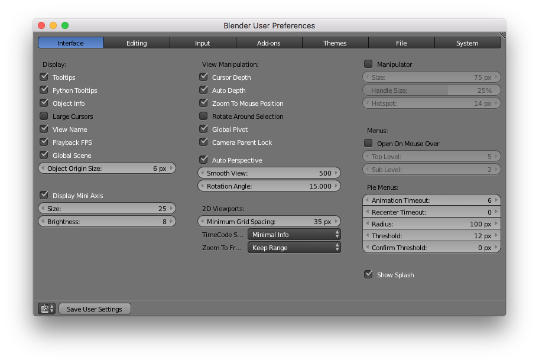
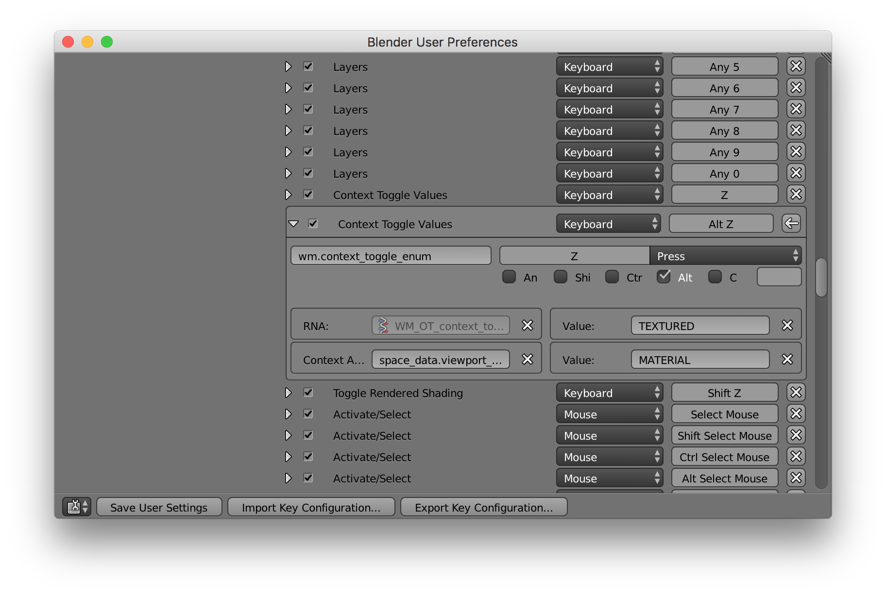
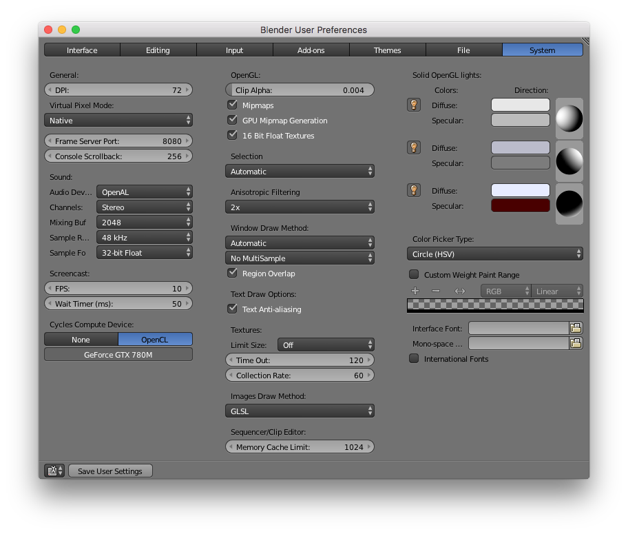

# Blender Custom User Preferences

This set of personalized preferences for Blender is ever evolving toward a more efficient and pleasing workflow.


## Installation

To find out where Blender user preferences are stored on your machine run the following command in the Blender Python Console.

```
bpy.utils.user_resource('CONFIG')
```

The result should be something along these lines:
```
// On Mac
'/Users/username/Library/Application Support/Blender/2.78/config/'
```

To copy these custom preferences to your machine, replace the version number directory (`/Users/username/Library/Application Support/Blender/2.78`) with the corresponding directory contained in the top level of this repository.


# Documentation of Settings

To be concise, only changes to the default settings are documented.

## Key:

✓ = enable

☐ = disable

Any options within `<!--` and `--!>` are under consideration but not currently employed. They are only visible while editing the Markdown source of the documentation.

## User Preferences

Access this menu via `File > User Preferences...` <kbd>Cmd ,</kbd>.


### Interface



✓ Global Scene

✓ Auto Depth

✓ Zoom To Mouse Position

✓ Auto Perspective

Smooth View: 500

☐ Manipulator


### Input

Select With: Left

#### 3D View > 3D View (Global) > Set 3D Cursor
✓ Cmd


#### 3D View > 3D View (Global) > Context Toggle Values [Keyboard: Alt Z]
Value: TEXTURED
Value: MATERIAL

Change top value to `TEXTURED`, bottom value to `MATERIAL`. Toggle between texture and material shading modes with <kbd>Alt Z</kbd>.


<!-- #### 3D View > 3D View (Global) > Rotate View [Mouse: Mouse/Trackpad Pan]
☐ Rotate View [Mouse: Mouse/Trackpad Pan]
Disable mouse/trackpad pan from rotating view. -->

<!-- #### 3D View > 3D View (Global) > Zoom View [Mouse: Ctrl Mouse/Trackpad Pan]
☐ Ctrl
✓ Alt
Zoom with <kbd>Alt trackpad pan<kbd>. Same method as Adobe products.-->


### Add-ons

✓ Node Wrangler

✓ Import Images as Planes

✓ Bool Tool

✓ [Filmic Blender Add-on](https://github.com/gregzaal/filmic-blender-add-on)

Optional:

* 3D Print Toolbox

* [Animation Nodes](https://github.com/JacquesLucke/animation_nodes)

* [Sverchok](https://github.com/nortikin/sverchok)


### System



Cycles Compute Device: OpenCL

Images Draw Method [2D Texture]: GLSL

✓ Regional Overlap


## Settings within GUI

### Info Window

Render Engine [Blender Render]: Cycles Render


### Properties Window > Scene > Color Management

View: Filmic Log Encoding Base
Look: Base Contrast
